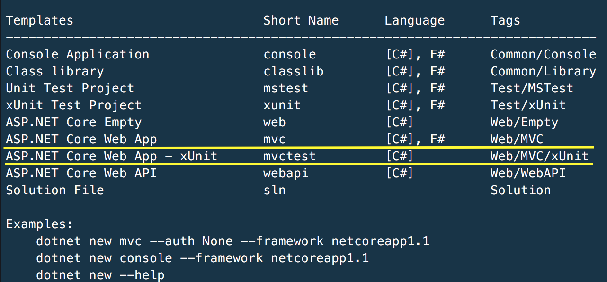

# AspNetCoreTemplate
A basic ASP.NET Core template to use with dotnet CLI.

This template create a complete solution for an ASP.NET MVC Core application, including a xUnit test project. You can use the resulting project inside Visual Studio for Mac, Visual Studio Code and Visual Studio 2017.

File structure:

    +-- AspNetCore.WebxUnit.sln
    +-- src
    |   +-- AspNetCore.WebxUnit
    |       +-- Controllers
    |       +-- Views
    |       +-- wwwroot
    |       +-- .bowerrc
    |       +-- AspNetCore.WebxUnit.csproj
    |       +-- Program.cs
    |       +-- Startup.cs
    |       +-- appsettings.Development.json
    |       +-- appsettings.json
    |       +-- bower.json
    |       +-- bundleconfig.json
    +-- test
    |   +-- AspNetCore.WebxUnit.Test
    |       +-- AspNetCore.WebxUnit.Test.csproj
    |       +-- UnitTest1.cs

## How to install it

In order to install this template in your computer, you must have installed [.NET Core](https://github.com/dotnet/core). If you want to check your dotnet core installation, open a terminal and run:

    dotnet --version

Next, clone this repo:

    git clone https://github.com/fcartu/AspNetCoreTemplate.git

And run this command:

**Be aware to change the path of the project for your own path.**

    dotnet new --install /Users/fcartu/github/AspNetCoreTemplate/Template

After installed you will see the new template in your template list.

## Uninstall

The current version of DotNet CLI does not support an uninstall command, so you must reset your templates back to the default list

**_Warning:_ this command will set back your dotnet new list to "factory defaults".**

    dotnet new --debug:reinit